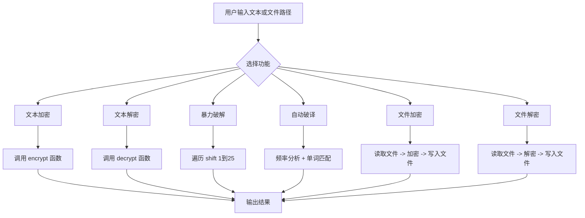

# 凯撒密码加解密与破译分析系统
## Caesar Cipher Encryption, Decryption and Cracking System

## 1. 项目简介

本项目是 Python 程序设计课程作业，主题为凯撒密码加解密与破译分析。项目基于 Python 实现了凯撒密码的文本加密、文本解密、暴力破解、自动破译、文件加密与文件解密等功能，并提供命令行版本和 Gradio 图形界面版本。

凯撒密码是一种经典的古典密码，其基本思想是将字母按照固定偏移量进行循环位移。本项目在完成基础的文本加解密功能同时依托字母频率分析实现了适合长文本环境的自动破译，并利用Gradio进行可视化的图形界面展示。

## 2. 功能说明

本项目围绕凯撒密码的实现与分析，设计并完成了以下功能模块：

1. **文本加密功能**  
   对用户输入的明文进行凯撒位移加密，生成对应密文。

2. **文本解密功能**  
   对用户输入的密文进行逆向位移处理，恢复原始明文。

3. **暴力破解功能**  
   当位移量未知时，程序可枚举 `1~25` 的所有可能位移结果，输出全部候选明文，辅助用户判断正确结果。

4. **自动破译功能**  
   程序结合英文字母频率分析和常见英文单词匹配，对候选结果进行评分，并自动推荐最可能的明文结果。

5. **文件加密功能**  
   支持读取 `.txt` 文件内容并完成加密，再将结果写入指定输出文件。

6. **文件解密功能**  
   支持读取加密后的 `.txt` 文件内容并完成解密，再将结果写入指定输出文件。

7. **命令行交互功能**  
   提供基于终端菜单的交互方式，便于用户通过功能编号完成不同操作。

8. **Gradio图形界面功能**  
   基于 Gradio 实现可视化交互界面，使程序具备更好的展示性和操作便利性。

## 3. 项目创新与拓展

相较于基础的凯撒密码对于文本的加解密程序，本项目进行了拓展：

1. 实现了暴力破解功能，可枚举全部可能位移结果。  
2. 实现了自动破译功能，提高了对未知密文的分析能力。  
3. 支持 `.txt` 文件的加密与解密，增强了程序的实用性。  
4. 增加了 Gradio 图形界面，提升了交互体验和展示效果。

## 4. 项目结构

```text
project1-caesar-cipher-wenchilao/
├── assets/              
│   ├── demo.mp4         
│   ├── gradio.mp4         
│   └── .gitkeep
├── cipher.py
├── cracker.py
├── file_handler.py
├── main.py
├── gradio_app.py
├── input.txt
├── output.txt
├── encrypted.txt
├── decrypted.txt
└── README.md
```

各文件功能说明如下：

- `cipher.py`：实现凯撒密码的核心加密与解密算法。  
- `cracker.py`：实现暴力破解和自动破译功能。  
- `file_handler.py`：实现文本文件的读取、写入、加密与解密。  
- `main.py`：命令行程序入口，提供菜单式交互。  
- `gradio_app.py`：Gradio 图形界面程序入口。  
- `input.txt`：测试输入文件。
- `output.txt`：Gradio测试输出文件。 
- `encrypted.txt`：文件加密后的输出示例。  
- `decrypted.txt`：文件解密后的输出示例。  
- `README.md`：项目说明文档。
- `demo.mp4`：命令行测试演示。
- `gradio.mp4`：Gradio图形界面演示。
- `.gitkeep`：占位文件。

## 5. 运行环境

- Python 3.10 及以上版本  
- Windows / macOS / Linux  
- 主要依赖库：`gradio`

## 6. 依赖安装

本项目主要依赖第三方库 `gradio`，其余模块均使用 Python 标准库实现，无需额外安装。

安装命令如下：

```bash
pip install gradio
```

## 7. 部署过程

为了保证程序能够正常运行，本项目的部署过程如下：

### 第一步：下载或克隆项目
将本项目下载到本地，或通过 Git 将仓库克隆到本地目录。

### 第二步：进入项目目录
打开终端，进入项目所在文件夹：

```bash
cd project1-caesar-cipher-wenchilao
```
### 第三步：检查Python环境
确认本机已安装Python 3.10及以上版本。

### 第四步：安装项目依赖
本项目主要依赖Gradio，可通过以下命令安装：
```bash
pip install gradio
```

### 第五步：运行程序
本项目支持两种运行方式
1.运行命令行版本：
```bash
python main.py
```
2.运行Gradio图形界面版本：
```bash
python gradio_app.py
```
运行Gradio界面后，终端会显示本地访问地址，在浏览器中打开即可使用图形界面。

## 8. 程序流程图



## 9. 演示动画(实际运行案例） 

[点击观看命令行界面演示视频](./assets/demo.mp4)

[点击观看Gradio图形界面演示视频](./assets/gradio.mp4)

## 10. 项目不足

尽管本项目实现了凯撒密码加解密、暴力破解、自动破译等功能，仍然存在一些不足之处：

1. **加密算法单一**： 当前实现的加密算法仅限于凯撒密码，后续可以考虑依托本项目实现其他加密算法。
2. **自动破译的局限性**：自动破译依赖字母频率分析和常见单词匹配，但对于一些特殊文本、密文较短或没有明显字母频率特征的情况，效果较差。后续可以引进基于机器学习的密码分析技术提高自动破译的准确性。
3. **暴力破解效率较低**：暴力破解算法的时间复杂度较高，对于长文本或大规模数据的破解效率较低。
4. **图形界面交互不足**：Gradio 界面较为简单，交互体验有所欠缺。
5. **文件格式支持不足**：目前仅支持 `.txt` 文件的加解密操作，未考虑对其他格式的支持，例如 `.pdf`、`.docx` 等文件格式。
6. **错误处理不完善**：当前程序对输入错误和异常情况的处理相对简单，未来可以加入更详细的错误提示和输入校验机制，提高系统的健壮性。
 
## 11. 参考资料

1. **Gradio 官方文档**   
   官网链接：[https://gradio.app/](https://gradio.app/)

2. **凯撒密码（Caesar Cipher）维基百科**  
   [https://en.wikipedia.org/wiki/Caesar_cipher](https://en.wikipedia.org/wiki/Caesar_cipher)  

3. **Python 官方文档**
   [https://docs.python.org/](https://docs.python.org/)

5. **Chatgpt的帮助**
   [https://chat.openai.com/](https://chat.openai.com/)

## 12. 作者信息
- **作者姓名**: 张亚航
- **学号**: 2241314539
## 13. 后记
对于我这种没有python基础的，这种规模的项目确实算是比较困难的，但是我还是在chatgpt的指导下一步一步建造了这个项目。在claude和chatgpt以及许多国产大模型流行后，我看到过有好多大佬调侃自己平时进行的是vibe coding，我虽水平微薄，仍有意斗胆给这个小项目的创造冠上一个vibe coding的名号。在这种规模比较小，技术比较固定或者成熟的境况下，ai辅助的编程或者ai主导的编程能大幅减少重复和不必要的时间成本。

这也许也是vibe coding作为一种工作方式的巨大缺陷：在庞大系统中ai没有系统的全局视图，ta只能提供局部优化，遇到问题会绕过而不是解决，结果会导致越改越乱。诚然ai的辅助能优秀的完成每一个模块的程序设计，但是整体的架构把握仍然需要人的存在。优秀的架构设计能够清晰定义边界，接口和规范等等，如果能够在尽可能优化的架构中使用日渐成熟的ai优化局部模块，也许效率之类的会提高很多。

我之前寒假懒得录制视频，想通过克隆声音的方式生成完整的音频，一开始完全没有头绪，我就去问gpt了，然后ta来一步一步教我怎么部署tts模型（最开始用的xtts在conda里安装，后来生成的音频我感觉挺像的但是其他人都说不像），后来改进的用的是（忘了），反正是需要我提供多段长时间文本音频进行训练（但是我后来没怎么做）。还有在vmware中装ubuntu的时候我参考了中科大同学撰写的linux 101文档，但是里面的教程比较简略，比如其中的系统安装界面的很多步的选项里面都没说怎么选择比较合适，但是ai就可以帮我选择最适合的。

ai真的能提高效率，但是我们更应该保持自己的ideas。用于ai训练的数据是人类产生的ideas，在ai的使用上我们可能更应该“政治挂帅”，而不是“技术挂帅”。😂 
